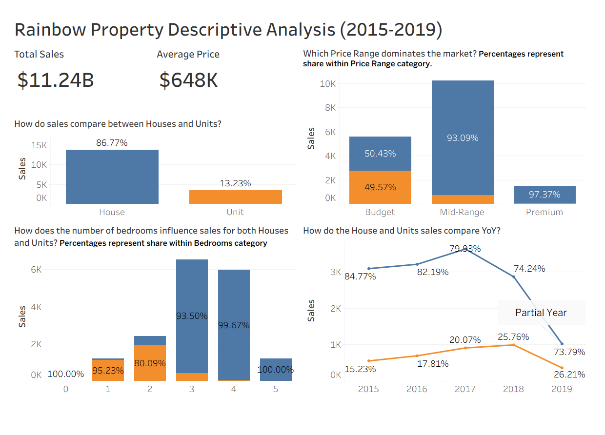

# Rainbow Property Descriptive Analysis (2015–2019)

## 🔗 Live Dashboard
- <a href="https://public.tableau.com/app/profile/stellan/viz/RainbowPropertyDescriptiveAnalysis2015-2019/RainbowPropertiesDashboard">View Dashboard on Tableau Public!</a>

# Business Context
Rainbow Homes is a real estate agency operating in the Australian Capital Territory (ACT) region. Leadership needed a comprehensive understanding of property market performance across their key districts to guide listing strategy, pricing decisions, and resource allocation.
This project analyses 17,340 property transactions across the ACT region between January 2015 and July 2019, uncovering patterns in sales volume, pricing trends, and buyer behaviour across property types, bedroom configurations, and price bands.

# Executive Summary
This project is a descriptive analytics solution that transforms 4.5 years of raw property transaction data into actionable market intelligence. It replaces manual spreadsheet reporting with a Tableau dashboard that enables stakeholders to explore market dynamics across multiple dimensions simultaneously.

# Tools Used
- Microsoft Excel (Advanced) — Power Query pipeline, data transformation, pivot analysis
- Tableau Public — Interactive dashboard and data visualisation
- GitHub — Project documentation and version control

# Stakeholder
Agency Principal / Managing Director
Branch Managers
Sales & Listing Teams

# Dataset Used
House Property Sales Time Series dataset sourced from Kaggle. The original dataset contained 29,581 rows covering 2007–2019. It was filtered to 2015–2019 to focus on recent market behaviour relevant to current strategic decisions.

- <a href="https://github.com/Estyell/sales-analysis-forecasting/blob/main/Transformed_Dataset.xlsx">Dataset</a>

# Cleaning & Transformations
All transformations were performed in Power Query to ensure a reproducible, automated pipeline.

## Key steps:

- Filtered dataset to 2015–2019 (removed pre-2015 data reflecting a different market environment)
- Renamed all columns to clean, readable names
- Set correct data types — Sale_Price as Currency, Sale_Date as Date
- Added Month_Year calculated column using Date.ToText(DateTime.Date([Sale_Date]), "yyyy-MM")
- Added Year column using Date.Year([Sale_Date])
- Added Quarter column using "Q" & Text.From(Date.QuarterOfYear([Sale_Date])) & " " & Text.From(Date.Year([Sale_Date]))
- Added Price_Range conditional column with data-driven thresholds:
Budget: below $500,000
Mid-Range: $500,000 – $1,000,000
Premium: above $1,000,000
- Added Districts column mapping postcodes to ACT districts:
2600–2612 → Inner Canberra
2614–2617 → Belconnen
2900–2906 → Tuggeranong
2911–2914 → Gungahlin
2618–2620 → Rural ACT

## Key Assumptions

- Each row represents one unique property sale transaction
- Sale_Price reflects the final transacted price, not the listing price
- 0-bedroom units are treated as studio apartments (legitimate property category)
- 0-bedroom houses (11 records) are flagged as anomalies — possibly vacant land or data entry errors — removed from dataset to reflect real transactions

# Business Questions

- How do sales compare between Houses and Units?
- Which Price Range dominates the market?
- How does the number of bedrooms influence sales for both Houses and Units?
- How do House and Unit sales compare year over year?

# Key Findings

# Market is overwhelmingly house-dominated
Houses account for 86.77% of all transactions (13,822 sales) vs 13.23% for units (3,518 sales). This is a house-led market across all price bands and years.

# Units are relevant only in the budget segment
In the Budget band, the house/unit split is nearly equal (50.43% houses vs 49.57% units). However in Mid-Range this shifts dramatically to 93.09% houses, and in Premium to 97.37% houses. Units compete primarily at entry-level price points.

# 3-bedroom properties dominate the market
With 6,526 sales, 3-bedroom properties form the market sweet spot — followed closely by 4-bedroom properties at 5,984 sales. The distribution forms a near-normal bell curve peaking at 3 bedrooms.

# Bedroom count is strongly cross-dependent with property type
1-bedroom properties are 95.23% units. 3-bedroom properties are 93.50% houses. 4 and 5-bedroom properties are almost exclusively houses (99.67% and 100% respectively). Property type must always be considered alongside bedroom count in any price analysis.

# Market peaked in 2017
Sales volume peaked at 4,541 transactions in 2017, with houses representing 79.93% of that year's sales. A cooling trend followed in 2018 (3,858 sales) continuing into 2019 (1,385 sales — partial year through July only).

# Unit market share growing in cooling years
While house dominance declined slightly from 84.77% in 2015 to 73.79% in 2019, units grew from 15.23% to 26.21% — suggesting units maintained relatively stronger demand during the market cooling period.

# Total market value: $11.24B across 4.5 years
# Average sale price across all transactions: $648K.

# Results & Impact
Delivered a single interactive dashboard replacing multiple static spreadsheet reports
Identified Inner Canberra as commanding a 54% price premium over other districts — actionable insight for listing strategy
Quantified the unit market share growth during market cooling — supporting diversification of listing focus
Documented data quality findings (0-bedroom anomalies, partial 2019 data) ensuring stakeholders interpret results correctly

---
📫 **Connect with me:** [LinkedIn Profile](https://www.linkedin.com/in/stella-ngei-95241565)
